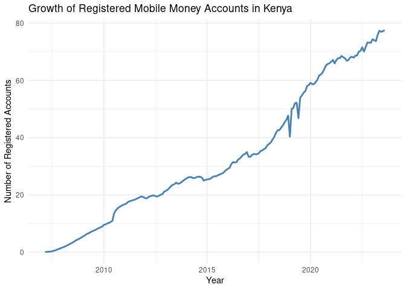
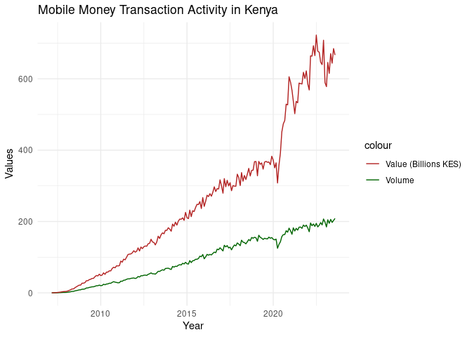
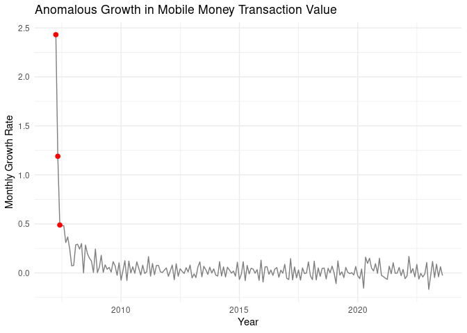

Time-Series Analysis and Anomaly Detection in Kenya’s Mobile Money
Ecosystem (2007–2023)
================
Robert Mbugua
2026-01-03

## Introduction

Mobile money systems play a central role in Kenya’s financial
infrastructure. Understanding long-term trends and abnormal deviations
in mobile money activity is critical for regulators, policymakers, and
financial institutions.

This project analyzes monthly mobile money agent data in Kenya from
January 2007 to August 2023, focusing on growth trends, transaction
volumes, values, and system-level anomalies using time-series analysis
in R.

## Load the dataset

``` r
library(tidyverse)
```

    ## ── Attaching core tidyverse packages ──────────────────────── tidyverse 2.0.0 ──
    ## ✔ dplyr     1.1.4     ✔ readr     2.1.6
    ## ✔ forcats   1.0.1     ✔ stringr   1.6.0
    ## ✔ ggplot2   4.0.0     ✔ tibble    3.3.0
    ## ✔ lubridate 1.9.4     ✔ tidyr     1.3.2
    ## ✔ purrr     1.2.0     
    ## ── Conflicts ────────────────────────────────────────── tidyverse_conflicts() ──
    ## ✖ dplyr::filter() masks stats::filter()
    ## ✖ dplyr::lag()    masks stats::lag()
    ## ℹ Use the conflicted package (<http://conflicted.r-lib.org/>) to force all conflicts to become errors

``` r
library(lubridate)

mobile_money <- read.csv("data/Mobile Payments.csv")

head(mobile_money)
```

    ##   Year  Month Active.Agents Total.Registered.Mobile.Money.Accounts..Millions.
    ## 1 2023 August        333428                                             77.55
    ## 2 2023   July        330912                                             77.21
    ## 3 2023   June        328543                                             76.99
    ## 4 2023    May        334726                                             77.34
    ## 5 2023  April        329968                                             75.96
    ## 6 2023  March        321149                                             73.72
    ##   Total.Agent.Cash.in.Cash.Out..Volume.Million.
    ## 1                                        208.61
    ## 2                                        202.85
    ## 3                                        197.42
    ## 4                                        205.88
    ## 5                                        194.95
    ## 6                                        204.83
    ##   Total.Agent.Cash.in.Cash.Out..Value.KSh.billions.
    ## 1                                            666.63
    ## 2                                            684.64
    ## 3                                            643.76
    ## 4                                            670.44
    ## 5                                            615.25
    ## 6                                            645.80

``` r
str(mobile_money)
```

    ## 'data.frame':    198 obs. of  6 variables:
    ##  $ Year                                             : int  2023 2023 2023 2023 2023 2023 2023 2023 2022 2022 ...
    ##  $ Month                                            : chr  "August" "July" "June" "May" ...
    ##  $ Active.Agents                                    : int  333428 330912 328543 334726 329968 321149 323613 319079 317983 315240 ...
    ##  $ Total.Registered.Mobile.Money.Accounts..Millions.: num  77.5 77.2 77 77.3 76 ...
    ##  $ Total.Agent.Cash.in.Cash.Out..Volume.Million.    : num  209 203 197 206 195 ...
    ##  $ Total.Agent.Cash.in.Cash.Out..Value.KSh.billions.: num  667 685 644 670 615 ...

## Create a proper date column

Create a date column from the given year and month columns

``` r
library(dplyr)
mobile_money <- mobile_money %>%
  mutate(date = ymd(paste(Year, Month, '01')),
         total_accounts=as.numeric(Total.Registered.Mobile.Money.Accounts..Millions.),
         volume=as.numeric(Total.Agent.Cash.in.Cash.Out..Volume.Million.),
         value=as.numeric(Total.Agent.Cash.in.Cash.Out..Value.KSh.billions.)
         )

# drop unnecessary columns
df <- select(mobile_money, date, total_accounts, volume, value, Active.Agents)

# descriptive statistics for the data
summary(df)
```

    ##       date            total_accounts         volume              value         
    ##  Min.   :2007-03-01   Min.   : 0.02099   Min.   :  0.02171   Min.   :  0.0644  
    ##  1st Qu.:2011-04-08   1st Qu.:17.79895   1st Qu.: 33.38400   1st Qu.: 89.9084  
    ##  Median :2015-05-16   Median :26.48365   Median : 90.50815   Median :230.9940  
    ##  Mean   :2015-05-17   Mean   :33.34168   Mean   : 94.44806   Mean   :260.6096  
    ##  3rd Qu.:2019-06-23   3rd Qu.:53.46420   3rd Qu.:151.67700   3rd Qu.:363.2445  
    ##  Max.   :2023-08-01   Max.   :77.55000   Max.   :208.61000   Max.   :722.5200  
    ##  Active.Agents   
    ##  Min.   :   307  
    ##  1st Qu.: 38726  
    ##  Median :130748  
    ##  Mean   :141793  
    ##  3rd Qu.:223003  
    ##  Max.   :334726

## Growth of Mobile Money Accounts

``` r
ggplot(df, aes(x = date, y = total_accounts)) + 
  geom_line(color='steelblue', linewidth = 1) + 
  labs(
    title = 'Growth of Registered Mobile Money Accounts in Kenya',
    x = 'Year',
    y = 'Number of Registered Accounts'
  ) +
  theme_minimal()
```

<!-- -->

## Transaction Volume vs Value Over Time

``` r
ggplot(df, aes(x = date)) + 
  geom_line(aes(y = volume, color = 'Volume')) + 
  geom_line(aes(y = value, color = 'Value (Billions KES)')) + 
  labs(
    title = 'Mobile Money Transaction Activity in Kenya',
    x = 'Year',
    y = 'Values'
  ) + 
  scale_color_manual(values = c('Volume' = 'darkgreen', 'Value (Billions KES)' = 'firebrick')) + 
  theme_minimal()
```

<!-- -->

## Detecting System-Level Anomlies (Shocks)

These anomalies can be detected using month-to-month growth rates

``` r
df <- df %>% 
  arrange(date) %>%
  mutate(
  value_growth = (value - lag(value)) / lag(value)
)

# create a threshold value 
threshold <- mean(df$value_growth, na.rm=TRUE) + 
              2 * sd(df$value_growth, na.rm=TRUE)
              
# detect anomalies
anomalies <- df %>%
  filter(value_growth > threshold)
  
anomalies %>% select(date, value_growth)
```

    ##         date value_growth
    ## 1 2007-04-01    2.4305682
    ## 2 2007-05-01    1.1897590
    ## 3 2007-06-01    0.4887091

- 2007‑04‑01: Growth = 2.43 → This means in April 2007, the total mobile
  money transaction value more than doubled from March. Huge spike for
  the system at that time, probably reflecting early adoption surges.

- 2007‑05‑01: Growth = 1.19 → May continued strong growth, up ~119% from
  April.

- 2007‑06‑01: Growth = 0.49 → June still saw ~49% growth — still high,
  but starting to stabilize.

These anomalies correspond to the very early adoption period of mobile
money in Kenya. The spikes in April to June 2007 indicate rapid uptake
of agent cash-in and cash-out services as the ecosystem scaled.

## Visualizing Anomalous Periods

``` r
ggplot(df, aes(x = date, y = value_growth)) +
  geom_line(color = "gray50") +
  geom_point(data = anomalies, aes(x = date, y = value_growth), color = "red", size = 2) +
  labs(
    title = "Anomalous Growth in Mobile Money Transaction Value",
    y = "Monthly Growth Rate",
    x = "Year"
  ) +
  theme_minimal()
```

    ## Warning: Removed 1 row containing missing values or values outside the scale range
    ## (`geom_line()`).

<!-- -->

## 8. Interpretation

## Findings

The analysis reveals sustained long-term growth in mobile money adoption
in Kenya, with distinct periods of abnormal transaction value growth.

These anomalies likely correspond to external shocks such as economic
disruptions, regulatory changes, or shifts in consumer behavior. The
results highlight the resilience and scalability of Kenya’s mobile money
system.
